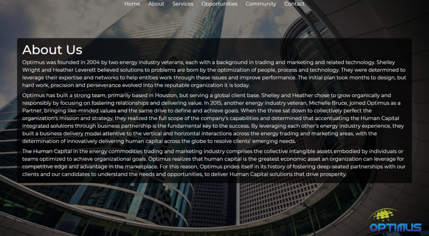
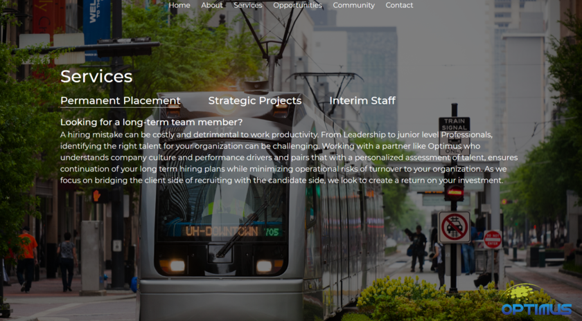
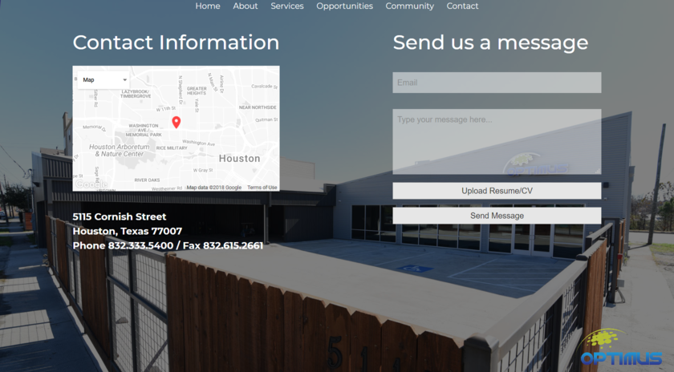
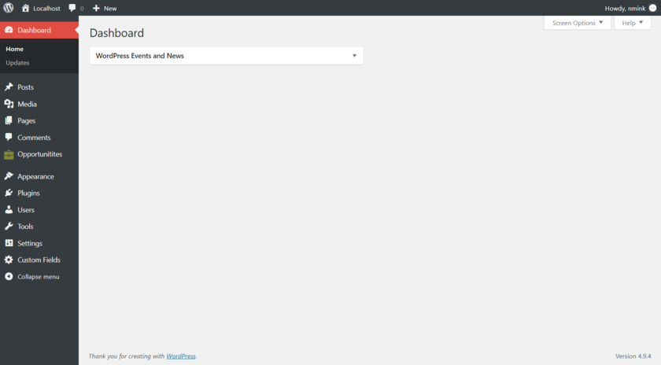
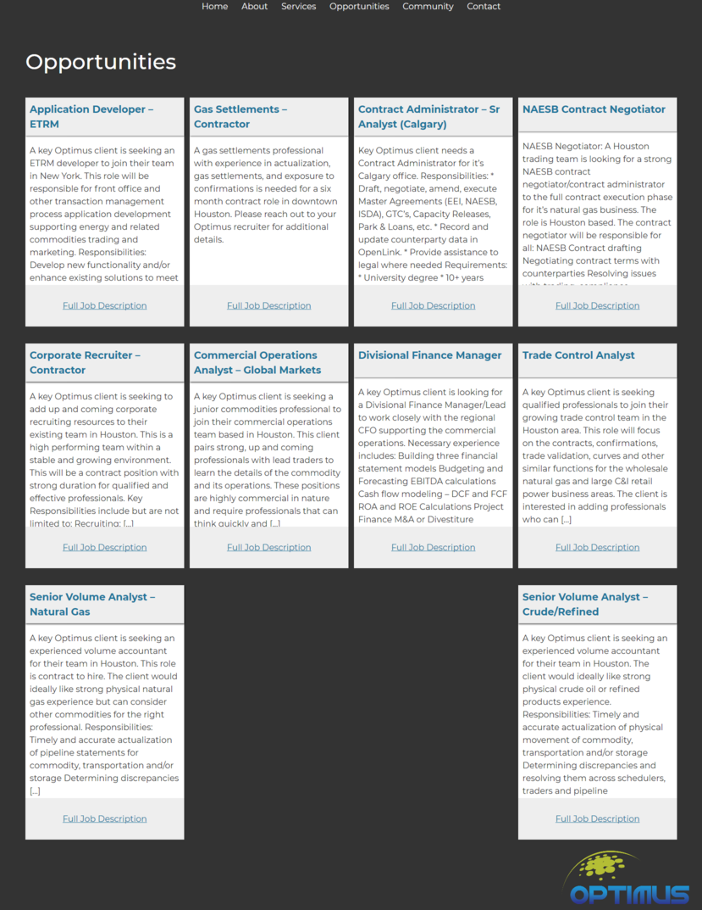

# Optimus WordPress Theme

A custom WordPress theme developed for a client which specializes in the energy industry.  
Tools used:
Underscores, HTML, Sass, Javascript, PHP, Advanced Custom Fields  

  
*Home Page*

  
*About Page*

  
*Services Page*

  
*Community Page*

  
*Contact Page*

*Custom post-type "Opportunities" for job listings*  

*Updates Pending*
---
**Opportunities page** -
Client is currently using maxhire for applicant tracking. Maxhire was purchased by Bullhorn, which no longer supports updates to their api. This is a possible opportunity to fix such situation. Currently, this page has a link to maxhire's old customer portal.

  
*Opportunities (Job listings page)*