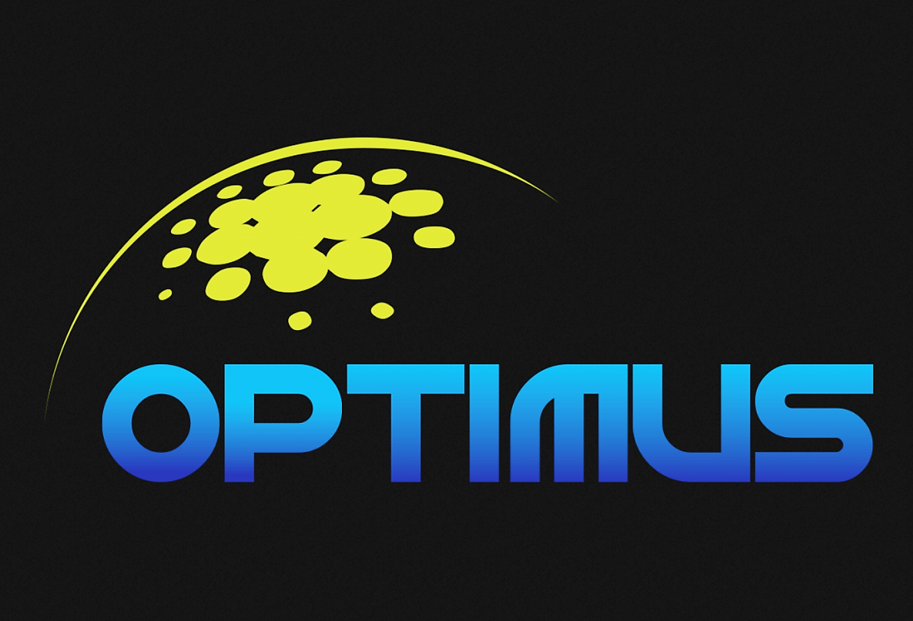
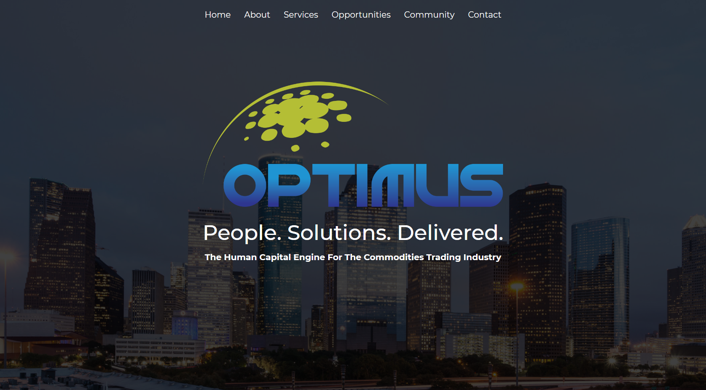
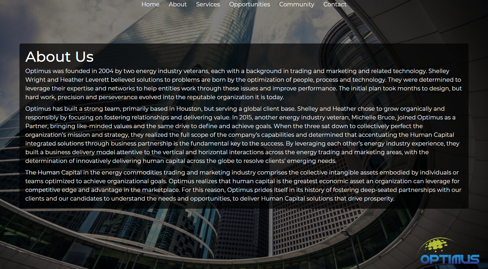
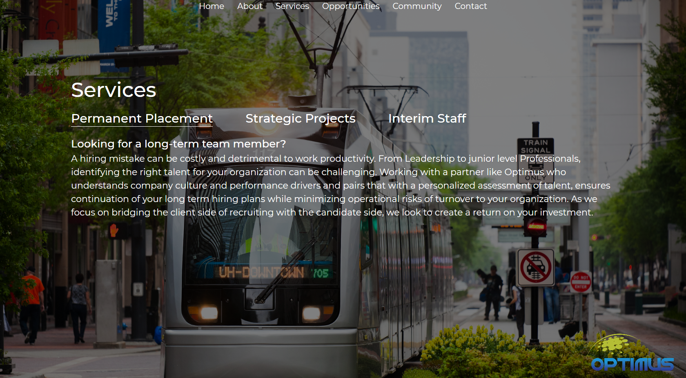
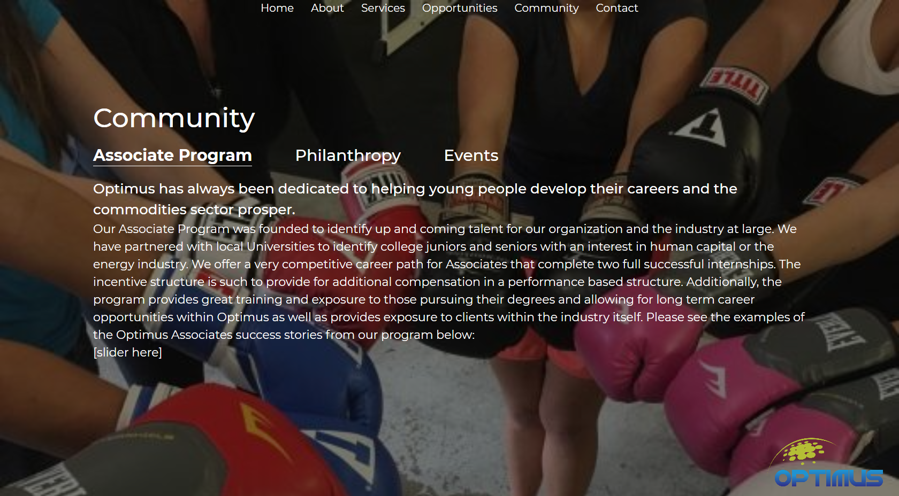

# Optimus WordPress Theme

A custom WordPress theme developed for a client which specializes in the energy industry.  
Tools used:
Underscores, HTML, Sass, Javascript, PHP, Advanced Custom Fields  

*Custom post-type for job listings*  

  

*Home Page*

  
  
*About Page*

  
*Custom post-type for job listings*

  
*Community Page*

  
*Contact Page*

*Updates Pending*
---
**Opportunities page** -
Client is currently using maxhire for applicant tracking. Maxhire was purchased by Bullhorn, which no longer supports updates to their api. This is a possible opportunity to fix such situation.

  
*Opportunities (Job listings page)*

